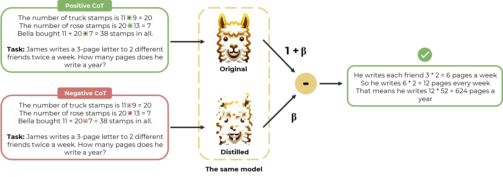

# Distillation Contrastive Decoding: Improving LLMs Reasoning with Contrastive Decoding and Distillation

[](https://colab.research.google.com/github/pphuc25/distil-cd/blob/main/examples/dcd_quickstart.ipynb)


This is the official repository for "[Distillation Contrastive Decoding: Improving LLMs Reasoning with Contrastive Decoding and Distillation](https://arxiv.org/abs/2402.14874?fbclid=IwAR2HOn0kzLgsTsSyXOSEYnRRyzLFA7-AmmQ35P3TRJRT_dA5Swn1jARXWlE)"
by [Phuc Phan](https://github.com/pphuc25), [Hieu Tran](https://github.com/heraclex12) and [Long Phan](https://github.com/justinphan3110)


## Introduction
In our paper, we introduce Distillation Contrastive Decoding (DCD), a novel approach designed to enhance the reasoning capabilities of large language models (LLMs) during inference. DCD leverages the power of contrastive chain-of-thought prompts (CP) and distillation to improve LLMs' task performance by minimizing reasoning errors.

DCD addresses the limitations of existing Contrastive Decoding techniques, such as the need for smaller parallel models and high memory usage, offering a more efficient and scalable solution. Our extensive evaluations across various reasoning benchmarks, including arithmetic and commonsense reasoning tasks, demonstrate the superior performance of DCD, marking a significant advancement in the field of natural language processing and LLM reasoning enhancement.




## Installation

To install the package, clone the repository and install the required dependencies:

```bash
git clone https://github.com/pphuc25/distillation-contrastive-decoding.git
cd distillation-contrastive-decoding
pip install -e .
```

## Quickstart

Our DCD approach is applicable for task generation in 🤗 Hugging Face with a beam size of 1. Here's a quick example of how to use it:

```python
# Import necessary libraries and functions
from transformers import AutoModelForCausalLM, AutoTokenizer, GenerationConfig
from dcd import dcd_pipeline_registry, set_stop_words, create_prompt, create_prompt_student

# Register 'DCD' into the greedy search of Hugging Face environment
dcd_pipeline_registry()

# Load the model and tokenizer
model = AutoModelForCausalLM.from_pretrained("model_name", device_map="auto")
tokenizer = AutoTokenizer.from_pretrained("model_name", device_map="auto")

# Set the generation configuration
generation_config = GenerationConfig(
    num_beams=1,
    
    # The settings provided here are compatible with most models. 
    # Feel free to modify the pad and eos token IDs as needed for your specific use case!
    pad_token_id=0,
    eos_token_id=0,
)

# Set the alpha, beta, and dropout rate
alpha_coef = 0.1
beta_coef = 0.8
dropout_rate = 0.2

# Define the question and format it
question = "Toulouse has twice as many sheep as Charleston. Charleston has 4 times as many sheep as Seattle. How many sheep do Toulouse, Charleston, and Seattle have together if Seattle has 20 sheep?"
question_formated = "Q: " + question + "\n" + "A:"
inputs = tokenizer(create_prompt(args_prompt, data_name=args_prompt.data_name) + question_formated, return_tensors="pt")
input_ids = inputs["input_ids"].to(device)

# Create input ids for the student model
inputs_student = tokenizer(create_prompt_student(args_prompt, type=type_prompt, data_name=args_prompt.data_name) + question_formated, return_tensors="pt")
input_ids_student = inputs_student["input_ids"].to(device)

# Generate the output sequences
output_sequences = model.generate(
    generation_config=generation_config,
    input_ids=input_ids,

    # Args of DCD
    input_ids_student=input_ids_student,
    teacher_student=True,
    dropout_rate=dropout_rate,
    alpha_coef=alpha_coef,
    beta_coef=beta_coef,
)

# Continue with your inference process...

```

## Examples

Check out [examples](./examples) of Distillation Contrastive Decoding (DCD), containing both applied dropout and dropout with quantize implementation. We welcome community contributions as well!


## DCD Evaluation

To facilitate easier evaluation or reproduction of DCD results, we have released a package framework, [DCD_eval](./dcd_eval), designed for few-shot evaluation of both arithmetic and commonsense reasoning on standard benchmarks. For more detailed information, please refer to our [paper]().


## Citation
If you find this useful in your research, please consider citing:

```
@misc{phan2024distillation,
      title={Distillation Contrastive Decoding: Improving LLMs Reasoning with Contrastive Decoding and Distillation}, 
      author={Phuc Phan and Hieu Tran and Long Phan},
      year={2024},
      eprint={2402.14874},
      archivePrefix={arXiv},
      primaryClass={cs.CL}
}
```
