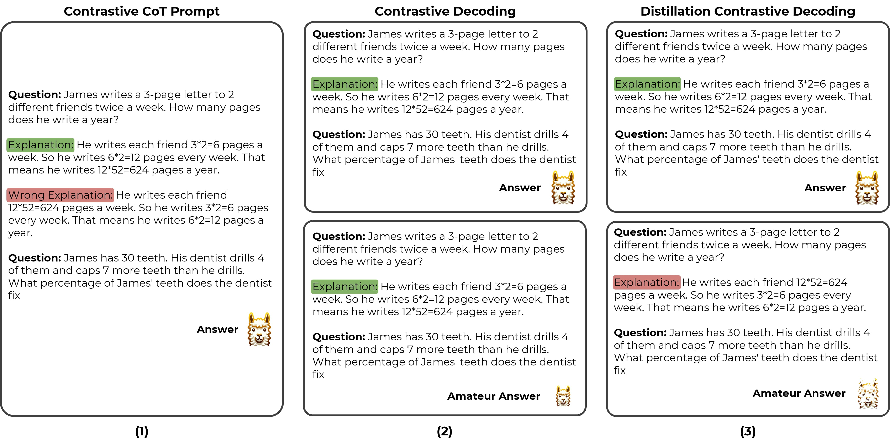

# Distillation Contrastive Decoding

This is the official repository for "[Distillation Contrastive Decoding: Improving LLMs Reasoning with Contrastive Decoding and Distillation]()"  
by [Phuc Phan](https://www.linkedin.com/in/pphuc/), [Hieu Tran](https://www.linkedin.com/in/hieutt0/) and [Long Phan](https://www.linkedin.com/in/long-phan-3110/)


## Introduction


<!--  -->


## Installation
```bash
git clone https://github.com/pphuc25/distillation-contrastive-decoding.git
cd distillation-contrastive-decoding
pip install -e .
```

## Quickstart
Our Distillation Contrastive Decoding apply for task generation in huggingface with beam size is 1. Currently support for 🤗 Hugging Face.

```python
from transformers import AutoModelForCausalLM, AutoTokenizer, GenerationConfig

from dcd import dcd_pipeline_registry, set_stop_words
from dcd import create_prompt, create_prompt_student

dcd_pipeline_registry()  # register 'DCD' into greedy search of Hugging Face environment.

model = AutoModelForCausalLM.from_pretrained("model_name", device_map="auto")
tokenizer = AutoTokenizer.from_pretrained("model_name", device_map="auto")

# Set the beam size to 1, add cot prompt for both expert and amateur model
generation_config = GenerationConfig(
    num_beams=1,
    pad_token_id=0,
    eos_token_id=0,
)

# Set the alpha, beta and dropout rate
alpha_coef = 0.1
beta_coef = 0.8
dropout_rate = 0.2

question = "Toulouse has twice as many sheep as Charleston. Charleston has 4 times as many sheep as Seattle. How many sheep do Toulouse, Charleston, and Seattle have together if Seattle has 20 sheep?"
question_formated = "Q: " + question + "\n" + "A:"
inputs = tokenizer(create_prompt(args_prompt, data_name=args_prompt.data_name) + question_formated, return_tensors="pt")
input_ids = inputs["input_ids"].to(device)

# Create input ids student
inputs_student = tokenizer(create_prompt_student(args_prompt, type=type_prompt, data_name=args_prompt.data_name) + question_formated, return_tensors="pt")
input_ids_student = inputs_student["input_ids"].to(device)

# Generate
output_sequences = model.generate(
    generation_config=generation_config,
    input_ids=input_ids,

    # Set the args for DCD
    input_ids_student=input_ids_student,
    teacher_student=True,
    dropout_rate=dropout_rate,
    alpha_coef=alpha_coef,
    beta_coef=beta_coef,
)
# This is done! Do the rest for infer model 
```


## Citation
If you find this useful in your research, please consider citing:

```

```
